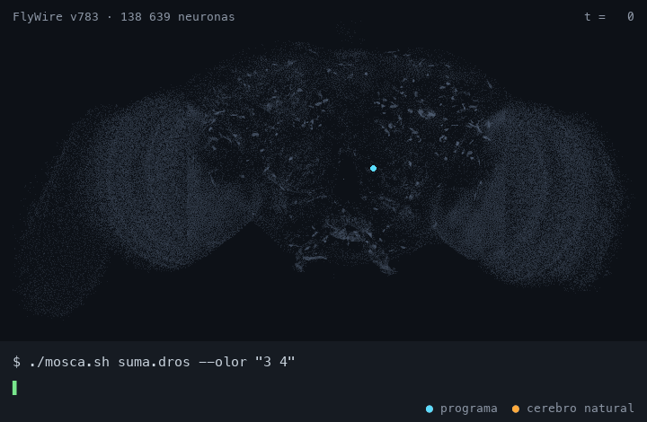

# Drosophila-Lang

Lenguaje de programación esotérico y Turing-completo que se ejecuta sobre el
cerebro real de una mosca de la fruta: el conectoma completo FlyWire v783
(138 639 neuronas y 2 700 513 conexiones con al menos cinco sinapsis).

En Drosophila-Lang no hay RAM ni reloj. Cada paso del programa se asigna a una
neurona real identificada, cada variable es la fuerza de una sinapsis entre
células de Kenyon y neuronas de salida del cuerpo en champiñón (que la dopamina
refuerza o debilita), y el programa termina cuando dispara la Fibra Gigante, la
neurona con la que la mosca escapa.

```
$ ./mosca.sh suma.dros --olor "3 4"
suma: 7
✝ FlyWire v783 · t = 87 · disparó la Fibra Gigante — muerte temporal · engramas: alfa=0, beta=0 · 3658 neuronas del cerebro despertaron en su vida
```



En azul, las neuronas que ejecutan el programa; en naranja, las del resto del cerebro
que se activan con ellas. Cada cuadro es un paso de la simulación.

## Documentación

| Documento | Para quién |
|---|---|
| [`docs/drosophila_lang_explicado.pdf`](docs/drosophila_lang_explicado.pdf) | Explicación de nivel de tercero de carrera: cómo se escribe un programa, el modelo de neurona con el que se ejecuta y la demostración de que el lenguaje es Turing-completo, con poco formalismo matemático. Es el mejor punto de partida. |
| [`docs/diapositivas.pdf`](docs/diapositivas.pdf) | Presentación del proyecto. |
| [`presentacion/index.html`](presentacion/index.html) | Presentación interactiva de unos 10 minutos para clase: se abre en el navegador sin instalar nada. Tiene el cerebro real en 3D, un intérprete para probar programas y la ejecución real de una suma. Flechas para avanzar, N para las notas de quien presenta. |
| [`articulo/drosophila_lang.pdf`](articulo/drosophila_lang.pdf) | Artículo formal: modelo dinámico, gramática EBNF, semántica operacional, demostración de completitud de Turing por reducción a máquinas de Minsky, cota de error y resultados. El código LaTeX está en [`articulo/drosophila_lang.tex`](articulo/drosophila_lang.tex). |

## Cómo funciona

El intérprete (`drosophila.py`) ejecuta cada programa en cinco fases:

1. **Lectura.** Analiza el código: glomérulos (estados), soplos (inicio) y engramas (variables).
2. **Reclutamiento.** Asigna cada pieza del programa a una neurona real con el papel
   adecuado: neuronas de proyección del lóbulo antenal, células de Kenyon, neuronas de
   salida del cuerpo en champiñón (MBON), dopaminérgicas PAM y PPL1, neuronas locales del
   cuerno lateral, receptores olfativos, motoneuronas, la descendente DNa02, la motoneurona
   MN9 de la probóscide y la Fibra Gigante (DNp01). Siempre que puede, sigue conexiones que
   existen de verdad en FlyWire.
3. **Implante.** Añade el circuito del programa entre esas neuronas, como si fuera un
   transgén. La entrada natural de las neuronas reclutadas se atenúa a 1/8 para que el
   resto del cerebro no corrompa el cálculo.
4. **Vida.** En cada paso *t* todas las neuronas integran y disparan. Las espigas del
   programa se propagan por las sinapsis reales y el resto del cerebro reacciona (se ve
   con `--traza` y en los visores 3D).
5. **Muerte.** Dispara la Fibra Gigante y el programa termina.

## El lenguaje

Un programa es un mapa de glomérulos. Cada línea es un estado: un glomérulo, una
secuencia de acciones y un desenlace.

```
%cepa Canton-S            ;; semilla del ruido neuronal
$ memoria = 3             ;; engrama: sinapsis KC → MBON con fuerza 3
~~~> (DM1)                ;; soplo inicial: el programa empieza en DM1
(DM1) +memoria !'a' ~> (VA2)
(VA2) ?memoria ~> (DM1) | (DL5)
(DL5) x_x                 ;; muerte: fin del programa
```

| Construcción | Significado | Neuronas reales |
|---|---|---|
| `$ r = n` o `§ r = n` | declara el engrama `r` con valor inicial `n` | sinapsis KC → MBON |
| `~~~> (X)` | empieza en el glomérulo `X` | neurona de proyección de `X` |
| `+r` / `-r` | suma / resta 1 al engrama `r` | PAM / PPL1 |
| `<r` | lee un número de la entrada (`--olor`) y lo suma a `r` | receptores olfativos |
| `!'c'`, `!"texto"`, `!n` | escribe un carácter, una cadena o un byte | motoneuronas y DNa02 |
| `!*` | emite una espiga contable | MN9 (probóscide) |
| `~> (X)` | salta al glomérulo `X` | — |
| `?r ~> (A) \| (B)` | si `r ≠ 0`, resta 1 y va a `A`; si no, va a `B` | KC, MBON y neuronas del cuerno lateral |
| `x_x` o `†` | termina el programa | Fibra Gigante (DNp01) |
| `;;` | comentario | — |

Si el nombre del glomérulo coincide con uno de los 53 glomérulos reales con receptores
anotados en FlyWire (`DA1`, `DM1`, `VA2`…), el estado se asigna a su neurona de
proyección real. La anatomía impone dos límites: 16 engramas como máximo (solo hay 16
neuronas PPL1) y 128 pruebas `?r` como máximo. Ambos dejan sitio para una máquina
universal. La gramática completa está en el artículo formal.

### Ejemplos incluidos

| Archivo | Qué hace | Salida |
|---|---|---|
| `efe.dros` | la primera palabra de la mosca | `F` |
| `hola.dros` | saludo en UTF-8 | `¡Hola, Mundo!` |
| `suma.dros` | suma dos enteros por transferencia sináptica (`--olor "3 4"`) | `suma: 7` |
| `longitud.dros` | cuenta los bytes de un texto (`--olor-texto "mosca"`) | `bytes: 5` |

## Instalación (macOS, una sola vez)

```bash
git clone https://github.com/UniversidadCamiloJoseCela/drosophila-lang.git
cd drosophila-lang
bash instalar.sh
```

`instalar.sh` crea un entorno virtual (`.venv`), instala numpy, pandas y pyarrow,
descarga el conectoma (unos 135 MB, se guarda en `~/.cache/drosophila-lang`) y ejecuta dos
pruebas. Se puede repetir sin problema: lo ya hecho no se rehace.

Sin descargar nada, cualquier programa se puede probar en un cerebro sintético con
`--cerebro sintetico`.

## Uso

```bash
./mosca.sh efe.dros                           # → F
./mosca.sh hola.dros                          # → ¡Hola, Mundo!
./mosca.sh suma.dros --olor "3 4"             # → suma: 7
./mosca.sh longitud.dros --olor-texto "mosca" # → bytes: 5
./mosca.sh suma.dros --olor "2 1" --traza     # actividad neuronal paso a paso
./mosca.sh suma.dros --reparto                # qué neurona real hace cada papel
./mosca.sh suma.dros --anatomia               # informe del cerebro
./mosca.sh --puertas                          # puertas lógicas en el cuerpo en champiñón
./mosca.sh -e "(DA1) !'F' x_x"                # código en línea
./mosca.sh --help                             # todas las opciones
```

Otras opciones útiles: `--temperatura` (ruido neuronal, T = 1/β; 0 = neuronas
exactas), `--cepa` (semilla del ruido), `--max-pasos` y `-q` (sin epitafio final).

### Comprobar la completitud de Turing

```bash
source .venv/bin/activate
python minsky.py                              # 200 máquinas de Minsky aleatorias
python minsky.py --maquinas 50 --semilla 7
```

Traduce máquinas de Minsky aleatorias a Drosophila-Lang, las ejecuta en el cerebro real y
compara los registros finales con una simulación directa en Python. Debe terminar con
«N/N máquinas … coinciden».

### Visor 3D

```bash
source .venv/bin/activate
python visor3d.py suma.dros --olor "3 4"      # crea suma_3d.html y lo abre
```

Muestra las 138 639 neuronas en su posición real y cómo se encienden en cada paso.
Arrastra para girar, usa la rueda o el pellizco para acercar, la barra espaciadora para
reproducir y las flechas para avanzar paso a paso.

### En vivo

```bash
source .venv/bin/activate
python envivo.py                              # abre http://127.0.0.1:8765
```

Escribe o elige un programa en el navegador y pulsa «Ejecutar en vivo»: la simulación
corre mientras la miras. Se puede cambiar la velocidad (hasta ~1 ms por paso, «tiempo
biológico»), pausar, detener y revisar pasos anteriores en la línea de tiempo. Para
cerrar el servidor, Ctrl + C en la Terminal.

Los dos visores tienen un panel «Alta resolución» para elegir la calidad en pantalla
(Estándar, Retina 2× o Supermuestreo 3×), el tamaño de los puntos, guardar imágenes PNG
en 4K u 8K y grabar vídeo MP4 o WebM.

## Estructura del repositorio

```
drosophila.py          intérprete
visor3d.py             visor 3D de la actividad neuronal (genera un HTML)
envivo.py              simulación en tiempo real en el navegador
minsky.py              comprobación empírica de la reducción a máquinas de Minsky
scripts/figuras.py     genera los datos de las figuras y tablas del artículo explicativo
scripts/gif_suma.py    genera docs/suma.gif (necesita Pillow)
*.dros                 programas de ejemplo
instalar.sh, mosca.sh  instalación y ejecución
articulo/              artículo formal (LaTeX y PDF)
docs/                  artículo explicativo y diapositivas (PDF)
presentacion/          presentación interactiva en HTML
```

## Desinstalar

```bash
rm -rf .venv ~/.cache/drosophila-lang
```

## Datos y créditos

- Conectoma: FlyWire v783 (Dorkenwald et al., *Nature* 2024).
- Anotaciones de tipos celulares y neurotransmisores: Schlegel et al., *Nature* 2024
  ([flyconnectome/flywire_annotations](https://github.com/flyconnectome/flywire_annotations)).
- Conectividad preparada por Shiu et al., *Nature* 2024
  ([philshiu/Drosophila_brain_model](https://github.com/philshiu/Drosophila_brain_model)).

El uso de los datos está sujeto a los términos del consorcio FlyWire. Si publicas algo
hecho con este proyecto, cita a FlyWire.
